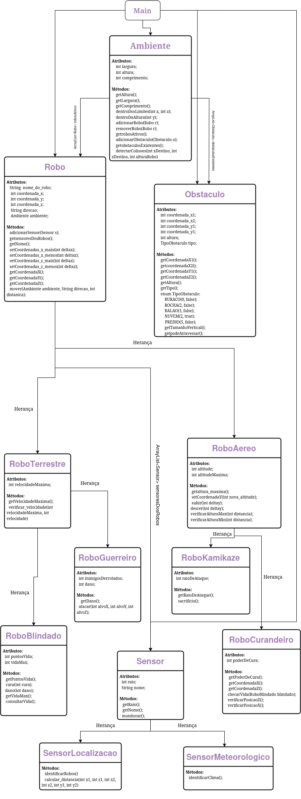

# Maria-Leticia-Julia-MC322

VERSAO JAVA 3.16

IDE- VSCODE

Julia de Souza Nardo 281272

Maria Leticia Gomes Braga dos Reis 281318

Main -> Leitura de inputs, mensagens do terminal e chamadas de funcao

Robo-> Classe mae {

  Robo terrestre -> so podem andar em x {
  
  Robo guerreiro -> pode atacar outros robos
    
  Robo blindado -> tem resistencia maior a dano
  }
  
  Robo aereo -> podem se mover em y {
  
  Robo curandeiro -> devolve vida aos robos blindados no seu eixo y
    
  Robo kamikaze -> ao ser eliminado, elimina todos os robos em um raio determinado
    
  }

Ambiente -> Configura as dimensoes do ambiente e os robos inseridos

Sensor -> classe mae {

  Sensor localizacao -> Imprime a distancia e localizacao dos robos em sua area
  
  Sensor meteorolico -> Identifica as condicoes climaticas em sua area
  
}

Obstaculo -> Objetos do ambiente, possuem dimensoes e podem ou nao bloquear a passagem de robos

Explicação do diagrama: A classe ambiente possui uma lista com os robos e obstaculos existentes e a classe Robo possui uma lista com os sensores, sendo que cada robo possui uma lista propria de sensores. A classe RoboTerrestre  e RoboAereo herdam da classe Ambiente. As classes RoboGuerreiro e RoboBlindado herdam da classe RoboTerrestre e as classes RoboKamikase e RoboCurandeiro herdam da classe RoboAereo. 

Para rodar o simulador compile a ultima pasta atualizada {

    javac *.java
    java Main

}

Siga as instrucoes apresentadas pelo simulador :)
